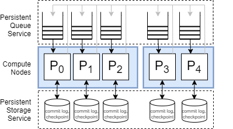

# Netherite: Introduction

Netherite is a distributed workflow execution engine for [Durable Functions](https://github.com/Azure/azure-functions-durable-extension) (DF) and the [Durable Task Framework](https://github.com/Azure/durabletask/) (DTFx). 

It is of potential interest to anyone developing applications on those platforms who has an appetite for performance, scalability, and reliability. 

As Netherite is intended to be a drop-in backend replacement, it does not modify the application API. Existing applications can switch backends with little effort.

## Why a new execution engine?

The default execution engine used by Durable Functions today is relying on Azure Storage, which makes it very easy to configure and operate. It uses queues for sending messages between partitions, and tables or blobs for storing the current state of instances (i.e. orchestrations and entities). However, a limiting property of this architecture is that it executes large numbers of small storage accesses. For example, executing a single orchestration with three activities may require a total of 4 dequeue operations, 3 enqueue operations, 4 table reads, and 4 table writes. Thus, the overall throughput quickly becomes limited by how many I/O operations Azure Storage allows per second. 

To achieve more throughput, Netherite represents queues and partition states differently, to improve batching:
- Partitions communicate via ordered, persistent event streams.
- The state of a partition (including the state of orchestrations and entities belonging to that partition) is stored using a combination of an immutable log and checkpoints.

Just as in the [previous architecture](https://docs.microsoft.com/en-us/azure/azure-functions/durable/durable-functions-perf-and-scale#orchestrator-scale-out), partitions are load-balanced at runtime over the available nodes. However, unlike before, Netherite partitions apply to both activities and orchestrations, so there is not a distinction between control queues and work-item queues.

The following picture illustrates the architecture, in a situation where five partitions are distributed over two nodes:

Each partition is represented in storage using the FASTER database technology, which also provides basic indexing and querying. We discuss this in more detail in the section on [storage organization](#/storage-organization.md).

Another advantage of this architecture is that we can store the current input queue position of a partition as part of the partition state. This is important in cases where we need to recover from a crash, or if we need to move a partition from one node to another. In those situation, the node that is restarting the partition can check the input position of the last processed message, and resume processing exactly where it left off. 

**Components.** Currently, Netherite relies on the following services:
- *EventHubs* provides the persistent queue service.
- *Azure Storage Page Blobs* provide the underlying raw storage for the logs.

In the future, we plan to support alternatives for these components. For example, Kafka instead of EventHubs, and K8s persistent volumes instead of Azure Page Blobs.

## Which engine to choose

The Durable Functions and Durable Task frameworks already support a multitude of execution engines. Choosing the right one depends on many factors that are specific to the intended scenario. Here are some considerations.

**Stronger guarantees**.
Like all back-ends for DF and DTFx, Netherite provides at-least-once guarantees for executing activities. 
It also provides some additional, stronger guarantees:

- All communication within a TaskHub (i.e. between orchestrations, activities, and entities) is transactionally consistent ("exactly-once"), since the EventHubs API allows us to deliver messages between partitions without any risk of duplication.
- All messages (between clients, orchestrations, activities, and entities) are delivered in order, because this is already guaranteed by EventHubs. For example, when sending a sequence of events or signals to an orchestration or entity, the delivery order is guaranteed to be the same as the sending order. 

**Better performance**.  
Netherite may provide higher throughput and lower latency, compared to 

- EventHubs can scale up to 32 partitions and 20 throughput units, which allows 20 MB/s worth of messages to be processed on 32 nodes. 
- Page Blobs allows more batching than table storage, which improves maximum throughput.
- Netherite can handle streams of entity signals more efficiently, because there is no need for explicit message sorting and deduplication
- EventHubs supports long polling. This improves latency compared to standard polling on message queues, especially in low-scale situations when polling intervals are high.
- Clients can connect to Netherite via a bidirectional EventHubs connection. This means that a client waiting for an orchestration to complete is notified more quickly.
- Netherite caches instance and entity states in memory, which improves latency if they are accessed repeatedly.
- Multiple orchestration steps can be persisted in a single storage write, which reduces latency when issuing a sequence of very short activities. It can improve throughput by up to 10x.

**Operational complexity**.
Because Netherite is built from more components (EventHubs, AzureStorage, Faster), its operational complexity is a bit higher compared to the default Azure Storage backend.

- Netherite requires users configure the EventHubs partition structure prior to running the application.
- The state of instances and orchestrations is encoded nontrivially in storage. Thus, it cannot be easily inspected using Azure Storage Explorer. Instead, such queries must be directed via the client API to the running service. 

This may improve in the future as we add more tooling.

## Status

The current version of Netherite is *0.1.0-alpha*.  Netherite already support almost all of the DT and DF APIs. However, there are still some limitations that we plan to address in the near future, before moving to beta status:

- **Auto-Scaling**. While it is already possible to dynamically change the number of host nodes (and have Netherite rebalance load automatically), support for doing so automatically is not implemented yet.
- **Query Performance**. We have not quite completed our implementation of a FASTER index to speed up queries that are enumerating or purging instance states.
- **Stability**. We do not recommend using Netherite in a production environment yet; although we have found and fixed many bugs already, we need more testing before moving to beta status. Any help from the community is greatly appreciated!
